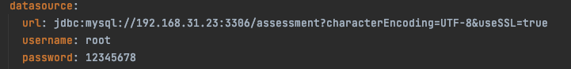
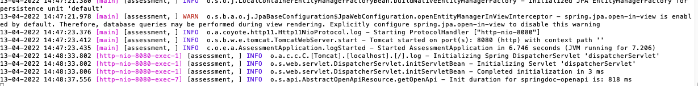
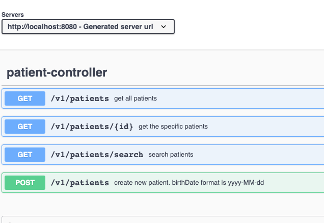
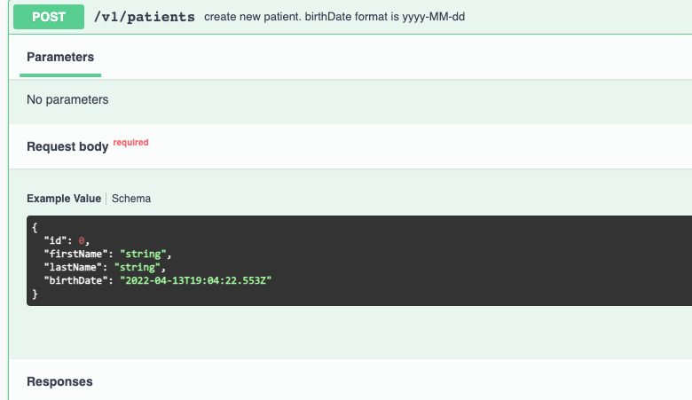
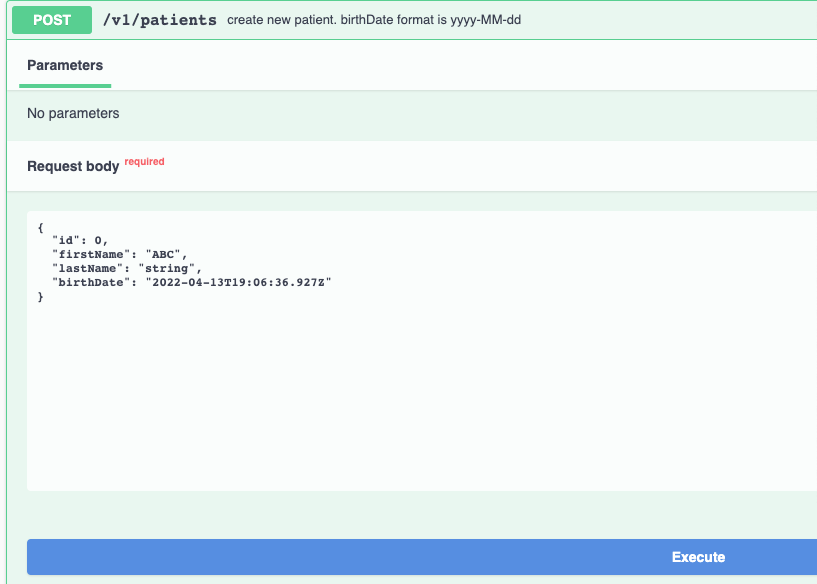
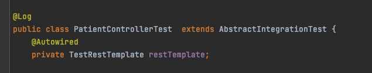
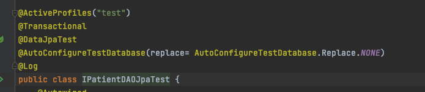
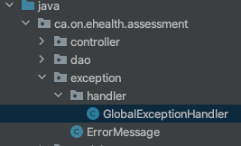
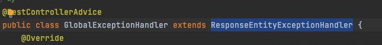

# eHealth Assessment
## Version(0.0.1-SNAPSHOT)

Include:

1. Rest Controller
2. JPA Repository
3. DTO Object Mapping
4. Integration Test
5. Unit Test
6. Rest Controller Error Handler
7. Rest API Online Document (based on Open API)
`
## Starting the Server
### 1.Modify database connect information

replace the  database connection's information  in application.yml and application_test.yml.(recommend having an individual test database)

> data source properties:

###  2.Create execuable jar package

`run: project_home/mvn clean package`

> Runing information includes test result:

###  3.Start Server

`run: project_home/mvn spring-boot:run`

> Terminal information:

_Server started successfully_

## API Document

### URL Address

`http://localhost:8080/swagger-ui-custom.html`
> Main page:

### Explor API Detail

### Execute API

## Test Case

### Integration Test

Those test cases will run in the real spring context, and use caching to reuse the similar spring context.
For thoses test cases need to extend AbstractIntegrationTest.Java

> Example:

### Unit Test

Those test cases will run in a sliced spring context. We use @DataJpaTest annotation and @WebMvcTest annotation to test data layer and web layer.

> Example:

## Error Handling
### Error package structure

### Gloable Exception Handler 

 provide gloable exception handling across rest controllers
 
 

